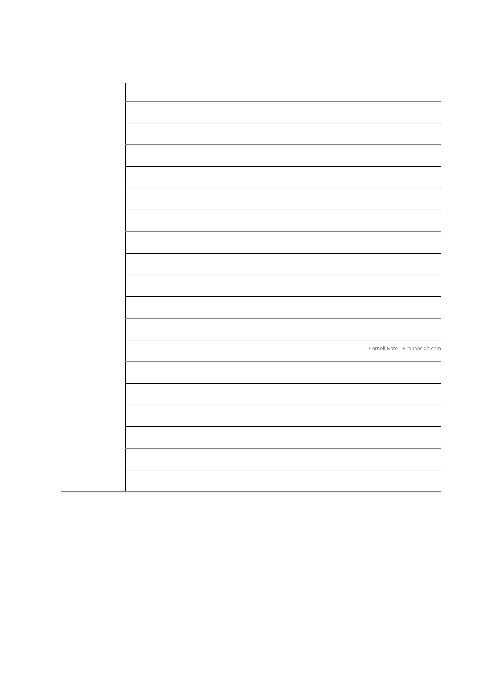
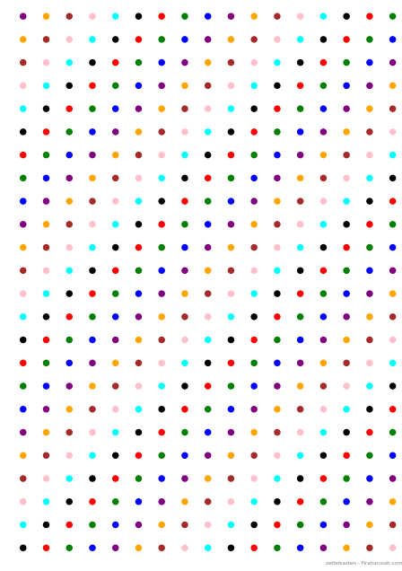
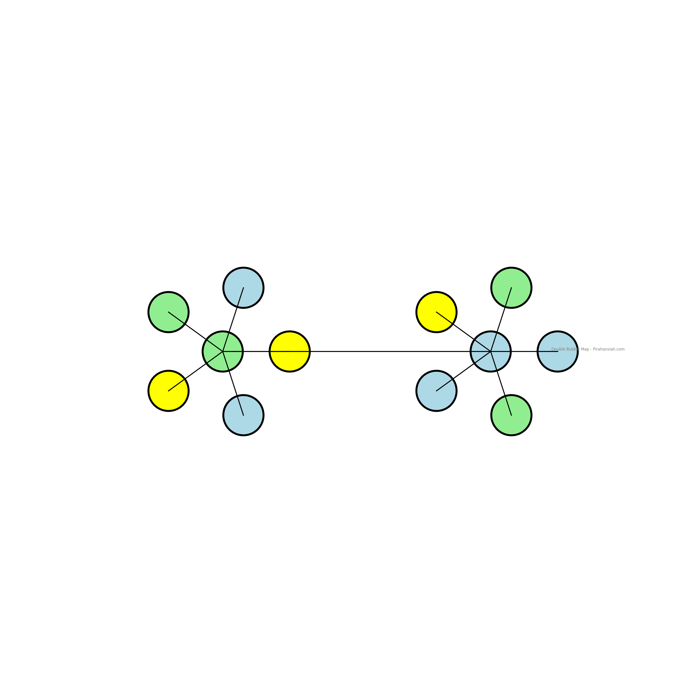
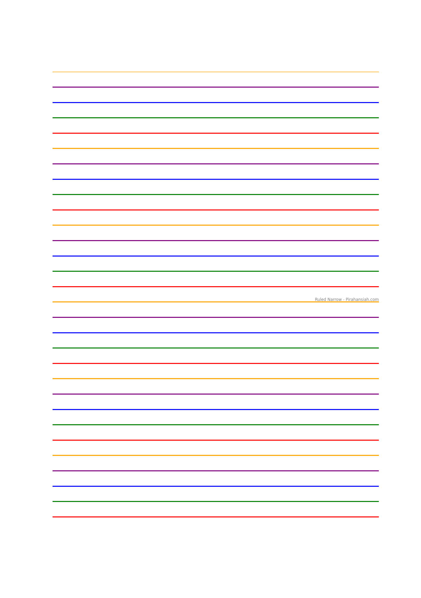
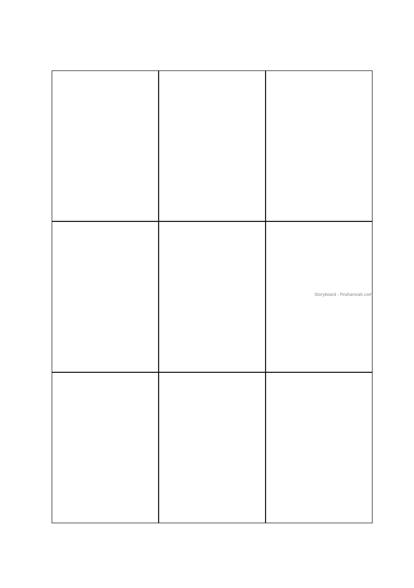

# Comprehensive List of Note-Taking Methods and Techniques

Here is a complete, updated list of all note-taking methods and techniques, including traditional, visual, knowledge management, modern digital, specialized academic, evidence-based, and newly identified or innovative ones from recent sources .

### Traditional Structured Methods
- Cornell Method
- Outline Method
- Charting Method
- Sentence Method
- Boxing Method
- T-Notes Method 
- Paragraph-Based 
- Capture + Create (Jim Kwik)

### Visual Methods
- Mapping/Mind Maps
- Sketchnoting
- Concept Maps
- Matrix Method
- Double Bubble Map
- Journal Dot Pattern
- Ruled Narrow
- Storyboard
- Annotation Method 

### Knowledge Management Systems
- Zettelkasten Method 
- Bullet Journal/Rapid Logging
- Flow-Based Method
- QEC (Question/Evidence/Conclusion) 

### Modern Digital Methods (Updated for 2025-2026)
- Voice Dump + AI Cleanup
- Collaborative/Group Note-Taking
- AI-Assisted Note-Taking 
    - NotebookLM 
- Hybrid Digital-Analog
- Digital Note-Taking
- Voice-to-Text Note-Taking
- Tablets and Styluses

### Specialized Academic Methods
- SQ3R Method
- Two-Column Notes

### Evidence-Based Strategies
- Retrieval Practice Integration
- Multi-Modal Note-Taking
- Spaced Note Review

### Other Techniques
- Color Coding System
- Rapid Logging Method 
- Handwritten Notes


# Note-Taking Methods Overview

### Capture + Create (Jim Kwik)
- **Capture**: Take down key points.
- **Create**: Interpret the information.
  - Consider how you can apply this knowledge.
  - Reflect on why it's important.
  - Think about when you'll need to use this information.

### Zettelkasten Method
- **Fleeting Notes**: Quickly jot down thoughts and ideas.
- **Literature Notes**: Record information from books and articles.
- **Permanent Notes**: Process and organize your knowledge into structured notes.
- **Linking**: Connect related ideas and concepts.
- **Keywords**: Use keywords to help you retrieve information later.

### Color Coding System
- Limit yourself to 3–5 colors.
- Maintain a consistent key or legend for each color.
- Apply the color coding system during the review phase.

---

## Traditional Structured Methods

### Cornell Method
**Structure**: Cues | Notes | Summary

| Cues & Questions (30%) | Notes & Details (70%) |
|:-----------------------|:----------------------|
| Key concepts           | Detailed information  |
| Questions              | Examples and facts    |
| Keywords               | Supporting details    |

**Summary Section**: Summarize the information in 3-4 sentences at the bottom.

**The 5 R's (Updated)**: Record (capture facts in the main area), Reduce (summarize into cues), Recite (recall aloud), Reflect (connect to existing knowledge), Review (spaced repetition).

**Use Case**: Lectures with clear structure, exam preparation, or textbook studying.

### Outline Method
```markdown
# Main Topic
- Major point 1
  - Supporting detail A
    - Sub-detail 1
    - Sub-detail 2
  - Supporting detail B
- Major point 2
  - Supporting detail C
```

**Use Case**: Organize lectures or hierarchical information.

### Charting Method
| Date | Event | Cause | Effect | Significance |
|------|-------|-------|--------|--------------|
| Data | Data  | Data  | Data   | Data         |

**Use Case**: Comparative analysis, multiple variables, or statistical analysis.

### Sentence Method
```markdown
1. **First Important Concept Explained**:
   - **Key Point 1**: Introduce the main concept.
   - **Key Point 2**: Present a secondary point.
   - **Example or Detail**: Provide an example.
   - **Another Idea**: Complement the concept.
```

**Use Case**: Fast-paced lectures, rapid capture.

### Boxing Method
**Topic 1: Concept Name**
- **Key Point 1**: Explain the main concept.
- **Key Point 2**: Discuss a secondary point.
- **Example or Detail**: Provide an example.
- **Another Idea**: Complement the concept.

**Topic 2: Another Concept**
- **Related Information**: Connect concepts.
- **Supporting Details**: Enhance understanding.

**Use Case**: Isolated topics, visual organization.

### T-Notes Method
- Divide page into T-shape: Top for general info (e.g., title, date), Left for equations/formulas/key terms, Right for explanations/thoughts/examples.
- **Benefits**: Efficient review, focus on priorities, adaptable for editing.

**Use Case**: STEM subjects like math, science, or coding; quick reference for formulas and derivations.

### Paragraph-Based Note-Taking
- Write detailed explanations in full paragraphs for context-rich capture.
- Similar to Sentence Method but with more narrative flow.

**Use Case**: In-depth subjects needing explanations, like literature or case studies.

---

## Visual Methods

### Mapping/Mind Maps
**Example**:
```markdown
                  Main Topic
                      |
      +---------------+---------------+
      |               |               |
  Subtopic 1      Subtopic 2      Subtopic 3
      |               |               |
  Details A       Details B       Details C
```

**Use Case**: Interconnected ideas, brainstorming, visual thinkers.

### Sketchnoting
**Example**:
```markdown
📊 Key Concept: [Topic Name]
┌─────────────────────────┐
│ 💡 Main Idea            │
│ ➜ Detail 1              │
│ ➜ Detail 2              │
│ ⚠️ Important note       │
└─────────────────────────┘
```

**Use Case**: Visual learning, creative fields, memory enhancement.

### Concept Maps
**Example**:
```markdown
Node-link diagrams showing hierarchical relationships between concepts with connecting labels describing relationships.
```

**Use Case**: Complex systems, scientific concepts, relationship mapping.

### Matrix Method
Grid-based comparison with categories as columns and items as rows.

**Use Case**: Comparing multiple items across dimensions.

### Double Bubble Map
```markdown
(Main Idea 1) <---> (Main Idea 2)
      |                     |
 (Difference 1)         (Difference 2)
      |                     |
(Similarity 1) <--> (Similarity 2)
```

**Use Case**: Comparing/contrasting two ideas.

### Journal Dot Pattern
- Dot grids for customizable layouts, diagrams, charts.

**Use Case**: Bullet journaling, flexible creative organization.

### Ruled Narrow
- Narrow-lined spacing for detailed, neat handwriting.

**Use Case**: Confined spaces, legible notes.

### Storyboard
| Frame 1 | Frame 2 | Frame 3 |
|---------|---------|---------|
| Scene 1 | Scene 2 | Scene 3 |
| Step 1  | Step 2  | Step 3  |

**Use Case**: Sequential processes, narratives, presentations.

### Annotation Method
- Highlight, underline, and add marginal notes directly in texts/PDFs.
- **Benefits**: Active engagement, quick retention without rewriting.

**Use Case**: Textbooks, digital PDFs, or reading-heavy subjects.

---

## Knowledge Management Systems

### Zettelkasten (Enhanced)
```markdown
# 202601021645 - Note Title
Tags: #concept #topic

## Main Idea
A single atomic concept expressed in your own words...

## Connections
- Related to []
- Builds on []
- Contradicts []

## References
- Source: Book name, Author, page 42
- URL: https://example.com

## Questions
- What implications does this have?
- How does this connect to X?
```

**Components**: Fleeting notes, literature notes, permanent notes, unique IDs, bidirectional links, keywords/tags.

**Use Case**: Long-term knowledge building, research.

### Bullet Journal/Rapid Logging
```markdown
## Daily Log - 2026-01-02

- Note or observation
○ Task to do
× Completed task
> Task migrated
< Task scheduled
- Subtask or detail
! Priority item
★ Important event
? Question to explore
```

**Symbols**: As listed.

**Use Case**: Daily logging, task management.

### Flow-Based Method
Capture concepts and connections naturally without hierarchy. Use indentation/arrows.

**Use Case**: Creative thinking, non-linear topics.

### QEC (Question/Evidence/Conclusion) Method
- **Question**: Pose the key query or problem.
- **Evidence**: Gather supporting facts from sources.
- **Conclusion**: Draw your own analytical insights.
- **Benefits**: Builds structured arguments, promotes critical thinking.

**Use Case**: Analytical subjects, essays, research, humanities.

---

## Modern Digital Methods (Updated for 2025-2026)

### Voice Dump + AI Cleanup
1. **Capture**: Speak thoughts rapidly.
2. **Cleanup**: AI organizes/structure.
3. **Synthesis**: Human review/connect.

**Tools**: Speech-to-text, ChatGPT/Claude.

**Use Case**: Rapid ideation, meetings.

### Collaborative/Group Note-Taking
```markdown
# Shared Notes - [Topic]
**Contributors**: Person A, B, C
**Last Updated**: 2026-01-02

## Section 1 (Person A)
Content...

## Section 2 (Person B)
Content...

## Questions/Discussion
- [Person C] What about X?
- [Person A] Response...
```

**Benefits**: Enhanced outcomes, shared load.

**Tools**: Google Docs, Notion, Obsidian Sync.

**Use Case**: Study groups, projects.

### AI-Assisted Note-Taking (Enhanced)
- **Integration**: Auto-transcription, summaries, concept extraction, links, question generation.
- **2026 Updates**: NotebookLM for audio overviews (AI podcasts discussing notes), deep research (auto-finds sources), FAQs/timelines.

**Tools**: NotebookLM, Notion AI, Obsidian plugins, Zotero Note Editor (for academic citations/notes).

**Use Case**: Research, large info volumes.

### Hybrid Digital-Analog
**Process**:
1. Handwrite notes.
2. Digitize with OCR/tablet.
3. Organize digitally.
4. Search/link electronically.

**Tools**: iPad + Apple Pencil + GoodNotes, Remarkable, OneNote.

**Use Case**: Combines handwriting benefits with digital search.

### Voice-to-Text Note-Taking
- Use speech recognition to convert spoken notes to text.
- **Benefits**: Hands-free, fast, accessible; edit for accuracy.

**Use Case**: Multitasking, noisy environments (with editing), disabilities.

### Tablets and Styluses
- Digital handwriting with editing/multimedia.
- **Benefits**: Tactile feel, searchable, backups.

**Use Case**: Sketches, portable digital notes.

### AI Meeting Assistants
- Auto-transcribe meetings, identify speakers, generate summaries/action items.
- **Tools**: Sembly AI (multilingual, integrations with Zoom/Teams).

**Use Case**: Professional meetings, high-volume notes; handles nuances with human review.

---

## Specialized Academic Methods

### SQ3R Method
**Survey**: Preview headings/summaries.  
**Question**: Formulate questions.  
**Read**: Active reading/annotate.  
**Recite**: Summarize in own words.  
**Review**: Spaced repetition, connect knowledge.

**Use Case**: Textbooks, academic reading, exams.

### Two-Column Notes
**Format**:
| Questions/Problems | Answers/Solutions |
|:-------------------|:------------------|
| What is X?         | X is defined as...|
| How to solve Y?    | Steps: 1, 2, 3... |

**Use Case**: Problem-solving, Q&A, self-testing.

---

## Evidence-Based Strategies (2025-2026 Research)

### Retrieval Practice Integration
**Concept:** [Topic]  

**Information...**  

**Self-Test Questions:**  
Q: What is the main principle?  
A: [Hidden - recall first]  

**Benefits**: 30-50% better retention, gap identification.

**Use Case**: All subjects, exams.

### Multi-Modal Note-Taking
**Topic:** [Name]  

**Text Notes:** Explanations...  

**Audio Note:** [Link to recording]  

**Visual Element:** [Diagram]  

**References:** Links...  

**Benefits**: Accommodates styles, richer capture.

**Use Case**: Complex topics, demonstrations.

### Spaced Note Review
# Note Metadata  
- Created: 2026-01-02  
- Review Schedule:  
  - [ ] 1 day (2026-01-03)  
  - [ ] 3 days (2026-01-05)  
  - [ ] 1 week (2026-01-09)  
  - [ ] 2 weeks (2026-01-16)  
  - [ ] 1 month (2026-02-02)  

**Benefits**: Combats forgetting, efficient timing.

**Tools**: Anki, RemNote, Obsidian plugins.

**Use Case**: Long-term learning, skills.

---

## PKM Integration Strategy

### Workflow Recommendations
**Capture Phase:** Quick Capture (Jim Kwik), Sentence/Outline for lectures, Voice Dump for ideation.  
**Process Phase:** Convert to Zettelkasten, Cornell for study, AI for organization.  
**Connect Phase:** Mind Maps for relationships, bidirectional links, color coding.  
**Review Phase:** Retrieval Practice, Spaced Review, collaborative sessions.

### Tool Setup for VSCode
**Extensions:** Markdown Preview Enhanced, Foam, Highlight, VSNotes.  

**Settings:**
```json
"highlight.regexes": {
    "^(# .*)": {"filterLanguageRegex": "markdown", "decorations": [{"color": "#88846f"}]},
    "^(! .*)": {"decorations": [{"color": "#F92672"}]},
    "^(\\? .*)": {"decorations": [{"color": "#66D9EF"}]}
}
```

---

## Method Selection Guide

| Situation              | Recommended Method                  |
|:-----------------------|:------------------------------------|
| Fast-paced lecture     | Sentence Method → Outline later     |
| Structured lecture     | Cornell or Outline                  |
| Visual learner         | Mind Maps or Sketchnoting           |
| Comparative analysis   | Charting or Matrix                  |
| Long-term knowledge    | Zettelkasten or QEC                 |
| Study group            | Collaborative + Shared docs         |
| Exam preparation       | Cornell + Retrieval Practice        |
| Research synthesis     | AI-Assisted + Zettelkasten          |
| Math/problem-solving   | Two-Column, T-Notes, or Boxing     |
| Daily productivity     | Bullet Journal or Rapid Logging     |
| Analytical essays      | QEC or Paragraph-Based              |
| Meetings/ideation      | Voice-to-Text or AI Assistants      |
| STEM formulas          | T-Notes                             |

---

## Color Coding Implementation

### Recommended Color System (3-5 colors)
- 🔴 **Red**: Critical concepts, warnings.
- 🔵 **Blue**: Definitions, key terms.
- 🟢 **Green**: Examples, applications.
- 🟡 **Yellow**: Questions, review areas.
- 🟣 **Purple**: Connections to topics.

### Application
```markdown
! Red: Critical deadline - Assignment due 2026-01-15
# Blue: Definition - Machine Learning is...
% Green: Example - In computer vision...
? Yellow: Question - How relates to neural networks?
~ Purple: Links to [[Deep Learning Fundamentals]]
```

---

### PNG Images






---

\newpage

<div style="page-break-after: always;"></div>


<style>
  @media print {
    h1, h2 { 
      page-break-before: always; 
    }
  }
</style>

---

 


# 2026 MY Note-Taking System: VSCode + Foam + ...

## Markdown Features
- **Color**: Use Markdown syntax or HTML for highlighting (e.g., `<span style="color: red;">text</span>`).
- **Tags**: Add `#tag` in notes for categorization and filtering.
- **Reference**: Generate Markdown references for wikilinks (e.g., at the bottom of notes) to enable non-Foam compatibility and GitHub navigation.
- **Links**: Standard Markdown links `[text](url)`.
- **Forward Links**: Outgoing links from a note to others (tracked automatically in Foam).
- **Backward Links**: Incoming links to a note (displayed in backlinks panel).
- **MOC (Map of Content)**: Create overview notes linking to related content.
- **TOC (Table of Contents)**: Use extensions like Markdown Preview Enhanced for auto-generated TOCs.
- **Flat Folders/Files**: Organize in a single directory for simplicity, with Foam handling connections via links.
- **YAML/Metadata**: Frontmatter at the top of notes (e.g., `---\ntitle: Note Title\n---`).
- **Categories**: Group via tags or YAML fields (e.g., `category: Topic`).
- **Icons and Bullet Journal/Rapid Logging**: Use emoji/icons (e.g., 📅) and symbols as you have:
- **HTML Tags to Extend Features**: For custom styling, embeds, or elements (e.g., `<div class="note-box">Content</div>`).
- **Wikilinks**: Connect notes with `[[note-title]]` for bidirectional linking and autocompletion.
- **Embeds**: Include content from other notes with `![[note-title]]` (transcludes sections or full notes).
- **Sections Support**: Link to specific note sections with `[[note-title#Section Heading]]`.
- **Link Aliases**: Display custom text for links with `[[note-title|Alias Text]]`.
- **Syntax Highlighting**: Foam highlights wikilinks, tags, and placeholders in the editor.
- **Note Embed with Sections**: Embed specific sections: `![[note-title#Section]]`.

## Metadata and Scheduling
- **Note Metadata**: As you have, with creation date and review schedule. also can use other methods like Anki to remmber better.
  ```markdown
  ---
  created: 2026-01-02
  review-schedule:
    - [ ] 1 day (2026-01-03)
    - [ ] 3 days (2026-01-05)
    - [ ] 1 week (2026-01-09)
    - [ ] 2 weeks (2026-01-16)
    - [ ] 1 month (2026-02-02)
  ---
  ```
- **Extended YAML Fields**: Add more for richer metadata:
  - `aliases: [alt-name1, alt-name2]` (for alternative note titles).
  - `status: draft/in-progress/complete` (track note lifecycle).
  - `priority: high/medium/low` (integrate with Bullet Journal).
  - `due-date: 2026-01-15` (for tasks).
  - `related: [note1, note2]` (manual connections).
  - `type: daily/moc/reference` (categorize note types).

## Panels and Views
- **Backlinks Panel**: View all notes linking to the current one, with context previews (activate via Foam commands).
- **Tag Explorer Panel**: Navigate and filter notes by tags; supports hierarchical tags (e.g., `#topic/subtopic`).
- **Graph Visualization**: Interactive graph of note connections (use `Foam: Show Graph` command).
- **Orphans Panel**: List unlinked notes for cleanup.
- **Placeholders Panel**: Manage incomplete wikilinks (e.g., `[[todo-note]]` creates placeholders).

## Commands and Automation
- **Daily Note**: Auto-create timestamped notes with `Foam: Open Daily Note`.
- **Create New Note**: Quick creation with `Foam: Create New Note`.
- **Create from Template**: Use templates for standardized notes (e.g., for reviews or Bullet Journals).
- **Open Random Note**: For serendipitous review with `Foam: Open Random Note`.
- **Sync Links on Rename**: Automatically update all links when renaming files.
- **Link Autocompletion and Navigation**: VSCode intellisense for wikilinks; navigate with Ctrl+Click.
- **Link Preview**: Hover to preview linked notes.

## Customizations and Extensions
- **Templates**: Create reusable note skeletons (e.g., in `.foam/templates/` folder) for Bullet Journal logs or metadata.
- **Custom Snippets**: VSCode snippets for rapid insertion (e.g., trigger "review" to insert your schedule checkboxes).
- **Custom CSS**: Style Markdown previews (e.g., via Markdown Preview Enhanced extension; add to `settings.json` for colors/icons).
- **Version Control with Git**: Integrate Git for backups, history, and collaboration (Foam works seamlessly with GitHub repos).
- **Publishing**: Export to static sites (e.g., GitHub Pages) using Foam's built-in tools.
- **Search Enhancements**: Use VSCode's global search or Foam's tag explorer for advanced querying.
- **Unique Identifiers**: Handle duplicate note names with minimal IDs (e.g., `[[folder/note]]`).
- **Task Management Integration**: Extend Bullet Journal with VSCode Tasks or extensions like Todo Tree for checkboxes.
- **Calendar View**: Use extensions like Calendar for daily notes integration.
- **AI Assistance**: Integrate extensions like GitHub Copilot for note generation/summarization within Foam.

## Workflow Best Practices
- **Atomic Notes**: Keep notes focused on single ideas for better linking.
- **Consistent Linking**: Use wikilinks everywhere to build your knowledge graph.
- **Daily Routine**: Start with `Foam: Open Daily Note`, add Bullet Journal entries, and review via graph/backlinks.
- **Review Integration**: Use your spaced repetition schedule with random note opens for reinforcement.
- **Flat Structure with MOCs**: Rely on links/tags over deep folders; use MOCs as hubs.
- **Backup and Sync**: Commit to Git regularly for version history and multi-device access.

This full list makes your system more interconnected, visual, and automated while staying lightweight. Start by cloning the Foam template repo (foam-template on GitHub) into VSCode, then customize with your elements.

## References
- Foam Official Documentation: Features like wikilinks, graph views, and templates.
- Foam GitHub Repo: Advanced commands, panels, and customizations.
- VSCode Setup with Foam: Best practices for PKM workflows and integrations.
- Foam VSCode Extension: Editing enhancements and recommended extensions.
- PKM Best Practices with Foam: Atomic notes, consistent habits, and Git integration.
- Note Structure Discussions: Ideas for metadata, categories, and flat organization.


